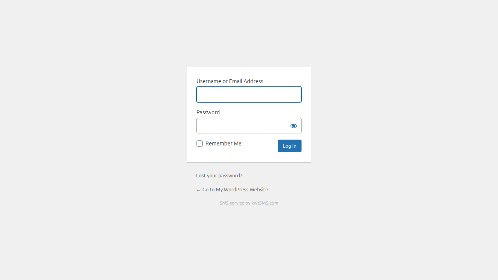
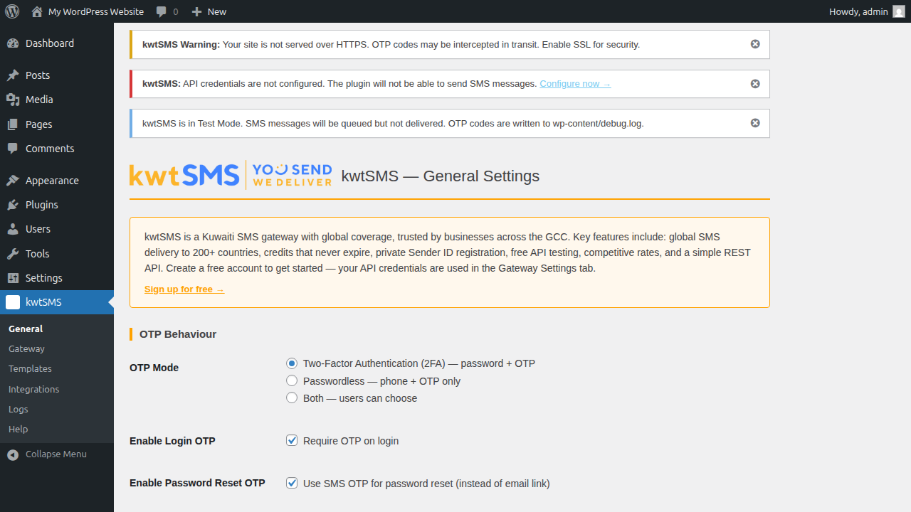
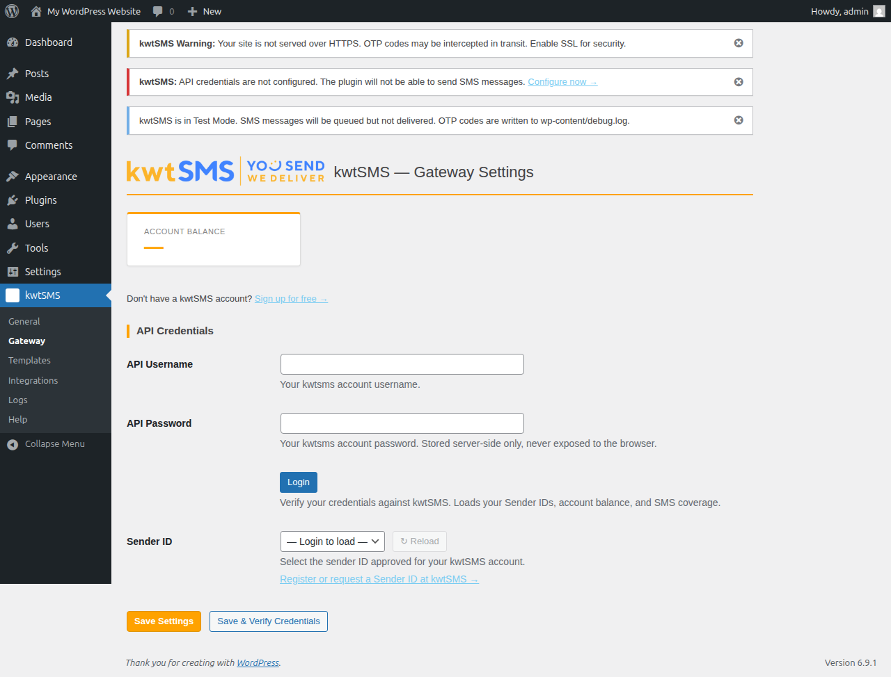
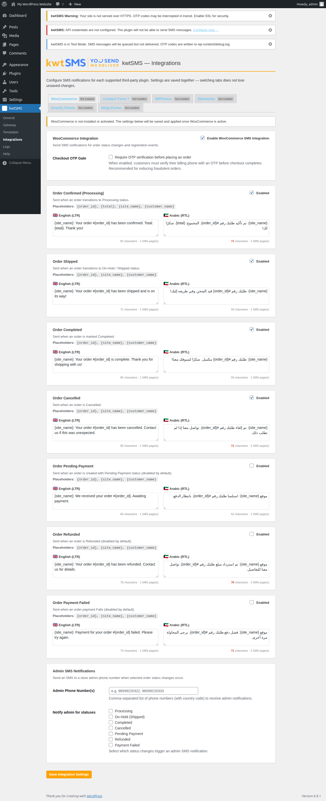
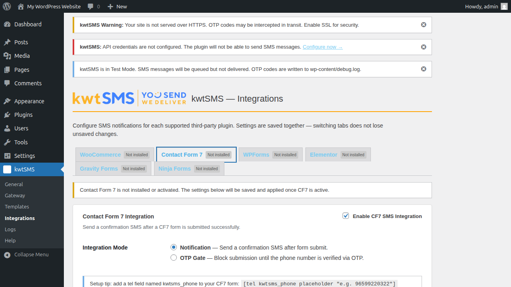
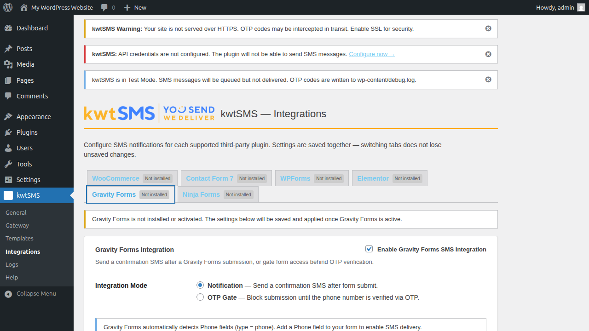

# kwtSMS: OTP & SMS Notifications — WordPress Plugin

Secure SMS-based OTP login, password reset, and WooCommerce / form notifications for WordPress — powered by the [kwtSMS](https://www.kwtsms.com) gateway.

**Version:** 3.0.0 | **Requires:** WordPress 6.0+, PHP 7.4+

> Don't have a kwtSMS account? [Sign up at kwtsms.com →](https://www.kwtsms.com/signup)

---

## Features

### Authentication
- **2FA mode** — standard password login followed by a one-time SMS code
- **Passwordless login** — phone number + OTP only; no password needed
- **Password reset via OTP** — replaces the default email reset flow with SMS
- **Per-role enforcement** — choose which user roles require OTP (e.g. skip OTP for subscribers)
- **Google reCAPTCHA v3** and **Cloudflare Turnstile** bot protection
- **Country code dropdown** on login forms — restrict to GCC or custom country list

### Security
- Cryptographically secure OTP generation (`random_int()`)
- **Sliding-window rate limiting** — per-phone, per-IP, per-account (no fixed-window gaming)
- **Phone blocking list** — silently drop OTP requests from blocked numbers (anti-enumeration)
- `hash_equals()` timing-safe OTP verification
- All cookies `httponly`, `secure`, `SameSite=Strict`
- Emergency bypass constant `KWTSMS_OTP_DISABLED` for lockout recovery

### WooCommerce
- **7 order status SMS**: Processing, Shipped, Completed, Cancelled, Pending, Refunded, Failed
- **Admin SMS notifications** — notify a configurable phone number on any order status change
- **Per-order custom SMS** — send a free-text SMS to the customer from the order edit screen
- OTP gate on WooCommerce checkout (verify phone before placing order)
- HPOS (High-Performance Order Storage) compatible

### Form Integrations — Notification or OTP Gate
Each integration supports two modes: **Notification** (send confirmation SMS on submit) or **OTP Gate** (block submission until phone is verified via OTP).

| Plugin | Auto-detected | Notification | OTP Gate |
|--------|:---:|:---:|:---:|
| Contact Form 7 | ✓ | ✓ | ✓ |
| WPForms | ✓ | ✓ | ✓ |
| Elementor Pro | ✓ | ✓ | ✓ |
| Gravity Forms | ✓ | ✓ | ✓ |
| Ninja Forms | ✓ | ✓ | ✓ |

### Balance & Gateway
- Account balance displayed on Gateway and Help pages without re-verifying credentials
- Pre-send balance check — warns before sending if credits are zero
- Test phone country code validation with hint text
- Test Mode — simulates sends without spending credits (OTP written to debug log)

### Admin
- 6 admin pages under the **kwtSMS** menu: General, Gateway, Templates, Integrations, Logs, Help
- Live credential verification with Sender ID auto-population
- OTP send log (last 100 entries)
- Dashboard widget with today's send count
- Full Arabic (RTL) translation included

---

## Screenshots

| | |
|---|---|
|  |  |
| Login page | OTP entry page |
|  |  |
| Admin menu (kwtSMS) | Gateway settings |
|  |  |
| WooCommerce order SMS | CF7 OTP gate mode toggle |
|  |  |
| Gravity Forms integration | Ninja Forms integration |

---

## Requirements

| | Version |
|---|---|
| WordPress | 6.0 or later |
| PHP | 7.4 or later (8.x recommended) |
| kwtSMS account | [Sign up free](https://www.kwtsms.com/signup) |
| WooCommerce | Optional |
| Contact Form 7 / WPForms / Elementor Pro / Gravity Forms / Ninja Forms | Optional |

---

## Installation

1. Clone or download this repository
2. Upload the `wp-kwtsms/` directory to `/wp-content/plugins/`
3. Activate from **Plugins → Installed Plugins**
4. Go to **kwtSMS → Gateway** and enter your API credentials
5. Click **Login** to verify credentials and load your Sender IDs
6. Configure OTP behaviour under **kwtSMS → General**

---

## Plugin Structure

```
wp-kwtsms/
├── wp-kwtsms.php
├── includes/
│   ├── class-kwtsms-plugin.php       # Main service locator (singleton)
│   ├── class-kwtsms-api.php          # kwtSMS HTTP API client
│   ├── class-kwtsms-settings.php     # Settings helper (wp_options wrapper)
│   ├── class-kwtsms-otp-engine.php   # OTP generate/verify, sliding-window rate limiting
│   ├── class-kwtsms-login-otp.php    # Login 2FA / passwordless hooks
│   ├── class-kwtsms-reset-otp.php    # Password reset OTP hooks
│   ├── class-kwtsms-user-meta.php    # Phone number field on user profile
│   ├── class-kwtsms-captcha.php      # reCAPTCHA v3 / Turnstile
│   ├── class-kwtsms-integrations.php # Integration loader
│   └── integrations/
│       ├── class-kwtsms-woo.php         # WooCommerce order SMS
│       ├── class-kwtsms-woo-metabox.php # Per-order custom SMS metabox
│       ├── class-kwtsms-cf7.php         # Contact Form 7
│       ├── class-kwtsms-wpforms.php     # WPForms
│       ├── class-kwtsms-elementor.php   # Elementor Pro
│       ├── class-kwtsms-gravityforms.php # Gravity Forms
│       └── class-kwtsms-ninjaforms.php  # Ninja Forms
├── admin/
│   ├── class-kwtsms-admin.php
│   └── views/
│       ├── page-general.php
│       ├── page-gateway.php
│       ├── page-templates.php
│       ├── page-integrations.php
│       ├── page-logs.php
│       └── page-help.php
├── assets/
│   ├── css/admin.css
│   ├── css/login.css
│   ├── js/admin.js
│   ├── js/login.js
│   └── js/form-otp.js   # OTP gate modal for form integrations
├── languages/
│   ├── wp-kwtsms.pot
│   ├── wp-kwtsms-ar.po / .mo
│   └── wp-kwtsms-en_US.po / .mo
├── tests/                # PHPUnit 9 + Brain\Monkey (191 tests)
└── uninstall.php
```

---

## Testing Locally (WP Playground)

No Docker required:

```bash
cd wp-kwtsms/
npx @wp-playground/cli@latest server --auto-mount
# Opens at http://localhost:9400
```

Enable **Test Mode** in Gateway settings — the OTP code is written to `wp-content/debug.log`.

### Running the Test Suite

```bash
cd wp-kwtsms/
composer install
./vendor/bin/phpunit --no-coverage
```

---

## Important API Notes

| Topic | Detail |
|---|---|
| **Promotional sender "KWT-SMS"** | Intentionally slow (100+ second delivery). Not suitable for OTP. Virgin (Zain-MVNO) Kuwait subscribers do not receive it. Use a private Sender ID for OTP. |
| **Kuwait delivery reports** | DLR is not available for messages to Kuwait numbers. The API returns "OK" once the message is handed off to the operator, but there is no confirmation of receipt. |
| **International coverage** | Disabled by default on new accounts. Contact kwtSMS support to enable. |
| **API rate limit** | Max 5 requests/second per IP. Exceeding this temporarily blocks your server IP. |
| **Test mode credits** | `test=1` — messages queued but not delivered, no credits consumed. Delete queued messages from your kwtSMS outbox to release any tentatively held credits. |
| **API error log** | Your kwtSMS account dashboard (API → Error Log) shows all send attempts with error details. |
| **Server timezone** | The kwtSMS API server operates on Asia/Kuwait (GMT+3). |

---

## OTP Authentication Flows

### 2FA Login
```
1. User submits username + password → WordPress validates credentials
2. Plugin intercepts via authenticate filter (priority 30)
3. OTP generated and sent by SMS to the user's registered phone
4. Partial auth session stored in transient (15-minute TTL)
5. User redirected to OTP entry page
6. User enters code → verified → auth cookies issued → redirect to dashboard
```

### Passwordless Login
```
1. User clicks "Login with SMS OTP" on wp-login.php
2. User enters their phone number (with country code)
3. Plugin looks up user by kwtsms_phone meta
4. Same generic message shown whether phone is found or not (anti-enumeration)
5. If found: OTP sent → user enters code → logged in
```

### Password Reset via OTP
```
1. User clicks "Lost your password?"
2. Custom form: enter username, email, or phone number
3. If user found and has a phone: OTP sent via SMS
4. User enters OTP → redirected to WP password reset form
5. User sets new password → automatically logged in
6. If no phone on file: fallback to email reset with notice
```

### WooCommerce Checkout OTP Gate (optional)
```
1. Customer enters phone at checkout
2. On first "Place Order" click: OTP sent to phone
3. OTP entry field appears on checkout page
4. On second submission: OTP verified → order placed
```

### Emergency Bypass (Lockout Recovery)

**Option 1 — wp-config.php constant (easiest)**
```php
define( 'KWTSMS_OTP_DISABLED', true );
```
Skips the entire OTP system until removed.

**Option 2 — WP-CLI**
```bash
wp user update admin --user_pass="NewSecurePassword!" --allow-root
```

**Option 3 — SFTP / cPanel**
Rename `wp-kwtsms/wp-kwtsms.php` to `wp-kwtsms.php.disabled` — WP deactivates the plugin automatically.

---

## Error Reference

| Code | Meaning | Fix |
|------|---------|-----|
| ERR003 | Wrong credentials | Verify username/password at kwtsms.com |
| ERR008 | Sender ID not allowed | Choose an approved Sender ID |
| ERR010/011 | Insufficient credits | Top up your kwtSMS balance |
| ERR026 | No SMS coverage | Enable coverage for this country in your kwtSMS account |
| ERR006/025 | Invalid phone number | Ensure country code is included, digits only |
| ERR028 | Resend too fast | Wait 15 seconds between resend requests |
| ERR031/032 | Content rejected | Check template for spam-flagged content or bad language |

Full error code reference: [kwtSMS API Documentation (PDF)](https://www.kwtsms.com/doc/KwtSMS.com_API_Documentation_v41.pdf)

---

## Changelog

### 3.0.0
- Initial public release.

---

## License

GPL-2.0-or-later — see [GNU GPL v2.0](https://www.gnu.org/licenses/gpl-2.0.html)

---

Powered by [kwtSMS.com](https://www.kwtsms.com) — Kuwait's SMS gateway
