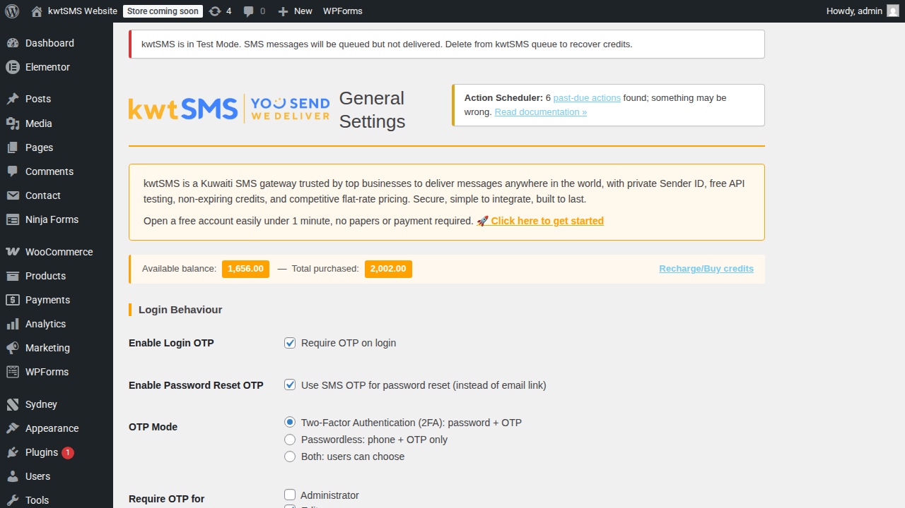
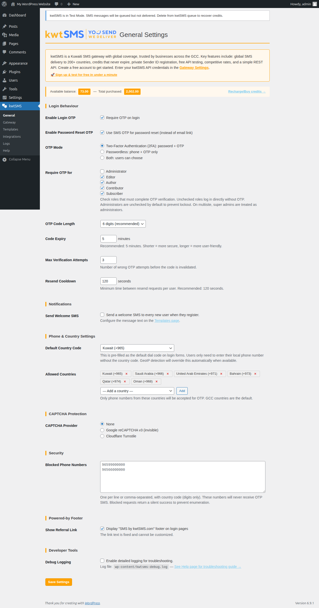
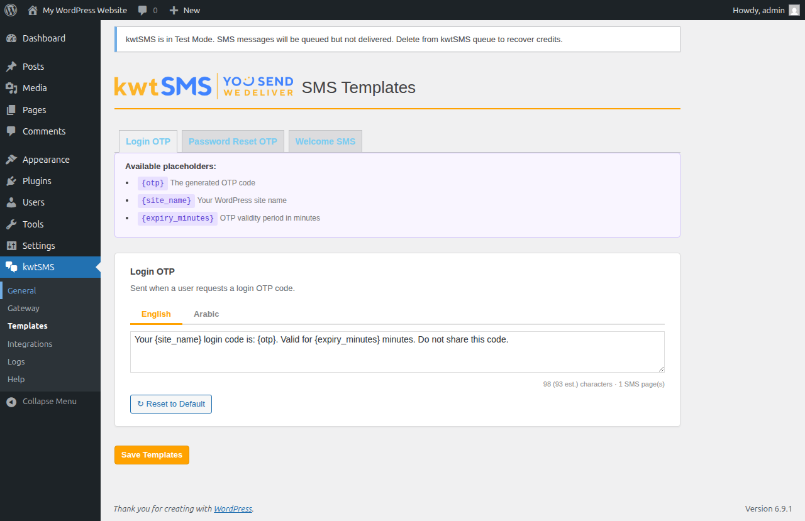
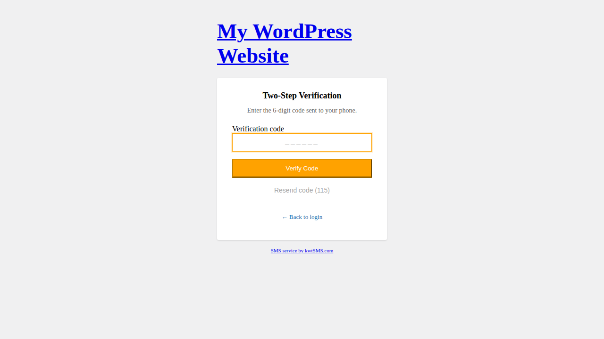
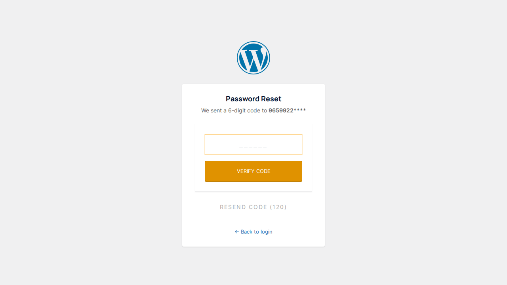
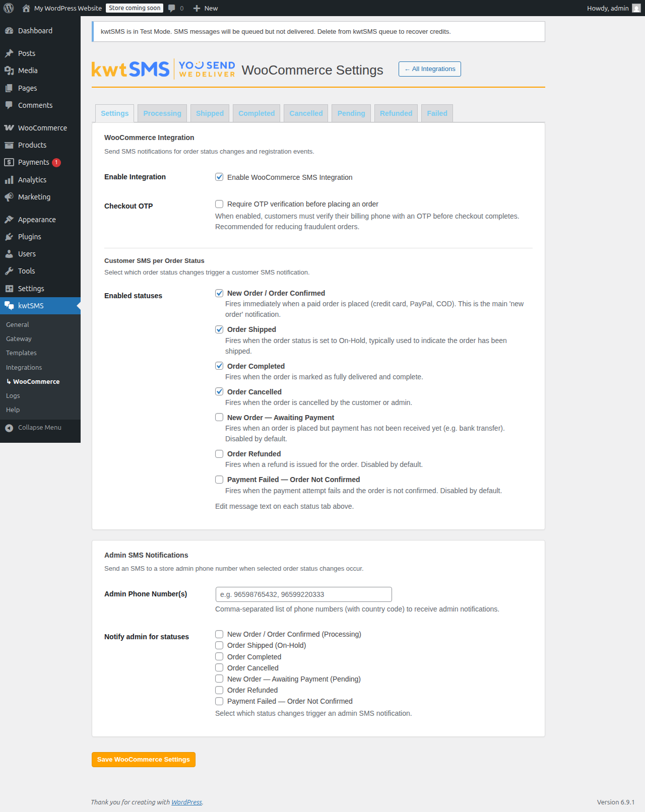
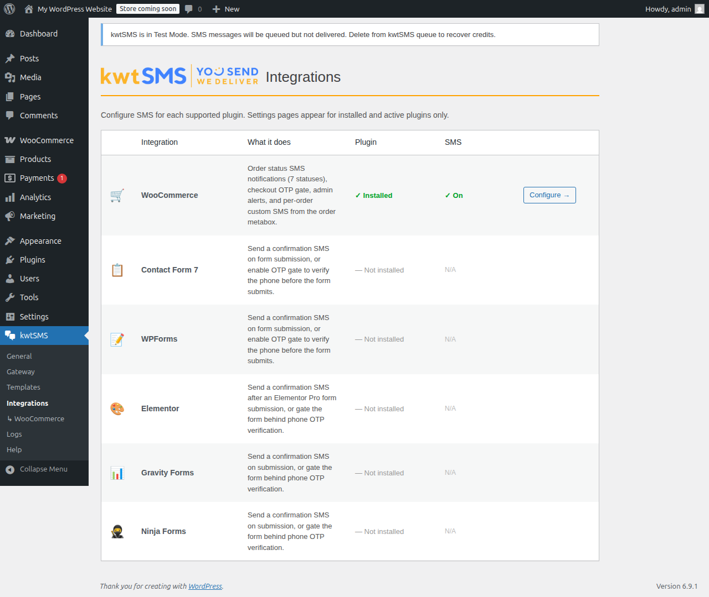
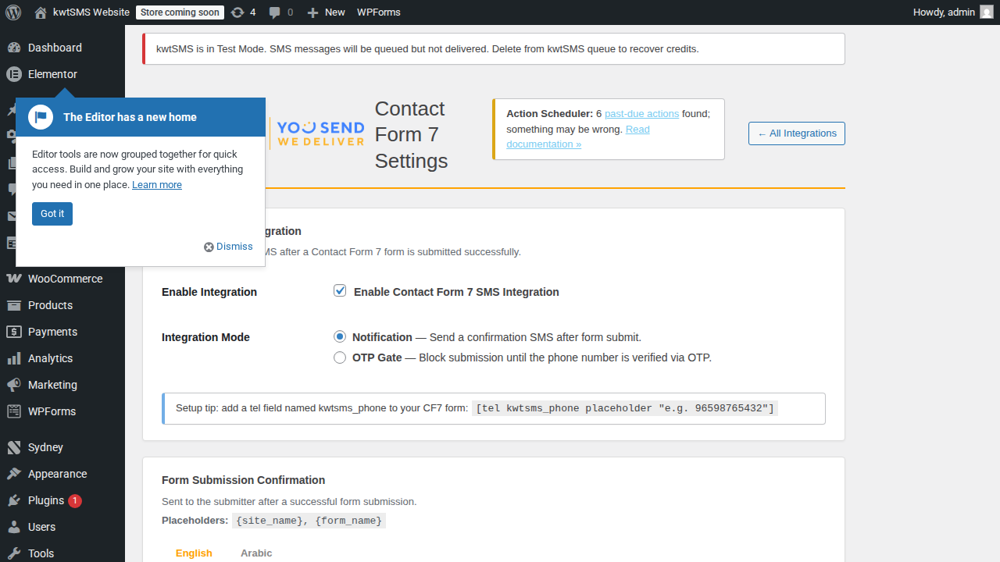

# kwtSMS: OTP & SMS Notifications, WordPress Plugin

[](https://github.com/boxlinknet/kwtsms-wordpress/actions/workflows/codeql.yml)
[](https://www.gnu.org/licenses/gpl-2.0.html)
[](https://wordpress.org)
[](https://php.net)
[](https://github.com/boxlinknet/kwtsms-wordpress/releases)
[](https://woocommerce.com)

Secure SMS-based OTP login, password reset, and WooCommerce / form notifications for WordPress, powered by the [kwtSMS](https://www.kwtsms.com) gateway.

**Version:** 3.0.3 | **Requires:** WordPress 6.0+, PHP 7.4+

> Don't have a kwtSMS account? [Sign up at kwtsms.com →](https://www.kwtsms.com/signup)

---

## About kwtSMS

kwtSMS is a Kuwaiti SMS gateway trusted by top businesses to deliver messages anywhere in the world, with private Sender ID, free API testing, non-expiring credits, and competitive flat-rate pricing. Secure, simple to integrate, built to last. Open a free account in under 1 minute, no paperwork or payment required. [Get started →](https://www.kwtsms.com/signup/)

---

## Features

### Authentication
- **2FA mode:** standard password login followed by a one-time SMS code
- **Passwordless login:** phone number + OTP only, no password needed
- **Both:** let each user choose their preferred method
- **Password reset via OTP:** replaces the default email reset flow with SMS
- **Per-role enforcement:** choose which user roles require OTP (e.g. skip OTP for subscribers)
- **Welcome SMS:** send a customisable welcome message when a new user registers
- **Google reCAPTCHA v3** and **Cloudflare Turnstile** bot protection
- **Country code dropdown** on login forms: restrict to GCC or custom country list

### Security
- Cryptographically secure OTP generation (`random_int()`)
- **Sliding-window rate limiting:** per-phone, per-IP, per-account (no fixed-window gaming)
- **Phone blocking list:** silently drop OTP requests from blocked numbers (anti-enumeration)
- `hash_equals()` timing-safe OTP verification
- All cookies `httponly`, `secure`, `SameSite=Strict`
- Emergency bypass constant `KWTSMS_OTP_DISABLED` for lockout recovery

### WooCommerce
- **7 order status SMS**: Processing, On-Hold (Shipped), Completed, Cancelled, Pending Payment, Refunded, Failed
- **Admin SMS notifications:** notify a configurable phone number on any order status change
- **Per-order custom SMS:** send a free-text SMS to the customer from the order edit screen
- OTP gate on WooCommerce checkout (verify phone before placing order)
- HPOS (High-Performance Order Storage) compatible

### Form Integrations: Notification or OTP Gate
Each integration supports two modes: **Notification** (send confirmation SMS on submit) or **OTP Gate** (block submission until phone is verified via OTP).

| Plugin | Auto-detected | Notification | OTP Gate |
|--------|:---:|:---:|:---:|
| Contact Form 7 | ✓ | ✓ | ✓ |
| WPForms | ✓ | ✓ | ✓ |
| Elementor Pro | ✓ | ✓ | ✓ |
| Gravity Forms | ✓ | ✓ | ✓ |
| Ninja Forms | ✓ | ✓ | ✓ |

### Balance & Gateway
- Account balance displayed on Gateway and Help pages without re-verifying credentials
- Pre-send balance check: warns before sending if credits are zero
- Test phone country code validation with hint text
- Test Mode: simulates sends without spending credits (OTP written to debug log)

### Admin
- 6 admin pages under the **kwtSMS** menu: General, Gateway, Templates, Integrations, Logs, Help
- **Users Without Phone** sub-page: lists all users missing a phone number, with inline edit and dynamic count badge on the Users menu item
- Live credential verification with Sender ID auto-population
- OTP send log (last 100 entries)
- Dashboard widget with today's send count
- Full Arabic (RTL) translation included

---

## Screenshots

<table>
<tr>
<td align="center">
<a href="assets/screenshot-1.png"></a><br>
<sub>General Settings: OTP mode, rate limits, CAPTCHA</sub>
</td>
<td align="center">
<a href="assets/screenshot-2.png"></a><br>
<sub>SMS Templates: English and Arabic with character counter</sub>
</td>
<td align="center">
<a href="assets/screenshot-3.png"></a><br>
<sub>2FA: OTP step after password login</sub>
</td>
<td align="center">
<a href="assets/screenshot-4.png"></a><br>
<sub>Passwordless: phone + OTP, no password needed</sub>
</td>
</tr>
<tr>
<td align="center">
<a href="assets/screenshot-5.png"></a><br>
<sub>Password reset: OTP replaces email link</sub>
</td>
<td align="center">
<a href="assets/screenshot-6.png"></a><br>
<sub>WooCommerce: order status SMS and checkout OTP gate</sub>
</td>
<td align="center">
<a href="assets/screenshot-7.png"></a><br>
<sub>Integrations: WooCommerce, CF7, WPForms, and more</sub>
</td>
<td align="center">
<a href="assets/screenshot-8.png"></a><br>
<sub>CF7: Notification or OTP Gate mode per form</sub>
</td>
</tr>
</table>

---

## Requirements

| | Version |
|---|---|
| WordPress | 6.0 or later |
| PHP | 7.4 or later (8.x recommended) |
| kwtSMS account | [Sign up free](https://www.kwtsms.com/signup) |
| WooCommerce | Optional |
| Contact Form 7 / WPForms / Elementor Pro / Gravity Forms / Ninja Forms | Optional |

---

## Installation

### Option 1: WordPress Plugin Directory (coming soon)

The plugin has been submitted to the WordPress.org directory and is pending review. Once approved:

1. In your WordPress dashboard, go to **Plugins → Add New Plugin**.
2. Search for **kwtSMS**.
3. Click **Install Now** next to "kwtSMS: OTP & SMS Notifications", then click **Activate**.

### Option 2: Upload via WordPress Admin (recommended until directory listing is live)

1. Download the latest `wp-kwtsms.zip` from the [Releases page](https://github.com/boxlinknet/kwtsms-wordpress/releases).
2. In your WordPress dashboard, go to **Plugins → Add New Plugin → Upload Plugin**.
3. Choose the downloaded `.zip` file and click **Install Now**.
4. Click **Activate Plugin**.

### Option 3: WP-CLI

```bash
# Download and install from the latest GitHub release
wp plugin install https://github.com/boxlinknet/kwtsms-wordpress/releases/latest/download/wp-kwtsms.zip --activate
```

### Option 4: Manual FTP / SFTP

```bash
# 1. Download and extract the release zip
wget https://github.com/boxlinknet/kwtsms-wordpress/releases/latest/download/wp-kwtsms.zip
unzip wp-kwtsms.zip

# 2. Upload the extracted wp-kwtsms/ folder to your server
scp -r wp-kwtsms/ user@yourserver.com:/var/www/html/wp-content/plugins/

# 3. Activate via WP-CLI (or from the Plugins screen in wp-admin)
wp plugin activate wp-kwtsms
```

### Option 5: Git clone (for developers)

```bash
cd /var/www/html/wp-content/plugins/
git clone https://github.com/boxlinknet/kwtsms-wordpress.git wp-kwtsms
wp plugin activate wp-kwtsms
```

### Initial Setup (all methods)

After activation:

1. Go to **kwtSMS → Gateway** in your WordPress dashboard.
2. Enter your **API Username** and **API Password** (from your kwtSMS account under Account → API Settings, not your login credentials).
3. Click **Login** to verify credentials. The Sender ID dropdown will populate automatically.
4. Select your **Sender ID** and click **Save Settings**.
5. Go to **kwtSMS → General** to configure OTP mode (2FA, Passwordless, or both), rate limits, and CAPTCHA.
6. Optionally enable **Test Mode** while setting up: OTP codes are written to `wp-content/kwtsms-debug.log` and no credits are consumed.

---

## Plugin Structure

```
wp-kwtsms/
├── wp-kwtsms.php
├── includes/
│   ├── class-kwtsms-plugin.php       # Main service locator (singleton)
│   ├── class-kwtsms-api.php          # kwtSMS HTTP API client
│   ├── class-kwtsms-settings.php     # Settings helper (wp_options wrapper)
│   ├── class-kwtsms-otp-engine.php   # OTP generate/verify, sliding-window rate limiting
│   ├── class-kwtsms-login-otp.php    # Login 2FA / passwordless hooks
│   ├── class-kwtsms-reset-otp.php    # Password reset OTP hooks
│   ├── class-kwtsms-user-meta.php    # Phone number field on user profile
│   ├── class-kwtsms-captcha.php      # reCAPTCHA v3 / Turnstile
│   ├── class-kwtsms-integrations.php # Integration loader
│   └── integrations/
│       ├── class-kwtsms-woo.php         # WooCommerce order SMS
│       ├── class-kwtsms-woo-metabox.php # Per-order custom SMS metabox
│       ├── class-kwtsms-cf7.php         # Contact Form 7
│       ├── class-kwtsms-wpforms.php     # WPForms
│       ├── class-kwtsms-elementor.php   # Elementor Pro
│       ├── class-kwtsms-gravityforms.php # Gravity Forms
│       └── class-kwtsms-ninjaforms.php  # Ninja Forms
├── admin/
│   ├── class-kwtsms-admin.php
│   └── views/
│       ├── page-general.php
│       ├── page-gateway.php
│       ├── page-templates.php
│       ├── page-integrations.php
│       ├── page-logs.php
│       └── page-help.php
├── assets/
│   ├── css/admin.css
│   ├── css/login.css
│   ├── js/admin.js
│   ├── js/login.js
│   └── js/form-otp.js   # OTP gate modal for form integrations
├── languages/
│   ├── wp-kwtsms.pot
│   ├── wp-kwtsms-ar.po / .mo
│   └── wp-kwtsms-en_US.po / .mo
├── tests/                # PHPUnit 9 + Brain\Monkey (191 tests)
└── uninstall.php
```

---

## Testing Locally (WP Playground)

No Docker required:

```bash
cd wp-kwtsms/
npx @wp-playground/cli@latest server --auto-mount
# Opens at http://localhost:9400
```

Enable **Test Mode** in Gateway settings. The OTP code is written to `wp-content/kwtsms-debug.log`.

### Running the Test Suite

```bash
cd wp-kwtsms/
composer install
./vendor/bin/phpunit --no-coverage
```

---

## External Services

This plugin connects to the following external services:

**1. kwtSMS API** (required): sends all SMS messages.
- Endpoint: `https://www.kwtsms.com/API/`
- Data sent: phone number, message text, API credentials
- When: every time an OTP or notification SMS is dispatched
- [Terms of Service](https://www.kwtsms.com/policy.html) | [Privacy Policy](https://www.kwtsms.com/privacy.html)

**2. ipapi.co** (optional): detects the visitor's country to pre-select the dial-code flag on the phone input.
- Data sent: visitor IP address only
- When: on the login page when Passwordless or 2FA mode is active; result cached 24 hours per IP
- Falls back to the default country in General Settings if unavailable
- [Terms of Service](https://ipapi.co/terms/) | [Privacy Policy](https://ipapi.co/privacy/)

**3. Google reCAPTCHA v3** (optional): bot protection on OTP forms. Only active when a reCAPTCHA Site Key is entered in General Settings.
- [Privacy Policy](https://policies.google.com/privacy)

**4. Cloudflare Turnstile** (optional): alternative bot protection. Only active when a Turnstile Site Key is entered in General Settings.
- [Privacy Policy](https://www.cloudflare.com/privacypolicy/)

---

## Important API Notes

| Topic | Detail |
|---|---|
| **Promotional sender "KWT-SMS"** | Intentionally slow (100+ second delivery). Not suitable for OTP. Virgin (Zain-MVNO) Kuwait subscribers do not receive it. Use a private Sender ID for OTP. |
| **Kuwait delivery reports** | DLR is not available for messages to Kuwait numbers. The API returns "OK" once the message is handed off to the operator, but there is no confirmation of receipt. |
| **International coverage** | Disabled by default on all accounts. Log in to your kwtSMS account and activate coverage for the countries you need. |
| **API rate limit** | Max 5 requests/second per IP. Exceeding this temporarily blocks your server IP. |
| **Test mode credits** | `test=1`: messages queued but not delivered, no credits consumed. Delete queued messages from your kwtSMS outbox to release any tentatively held credits. |
| **API error log** | Your kwtSMS account dashboard (API → Error Log) shows all send attempts with error details. |
| **Server timezone** | The kwtSMS API server operates on Asia/Kuwait (GMT+3). |

---

## OTP Authentication Flows

### 2FA Login
```
1. User submits username + password → WordPress validates credentials
2. Plugin intercepts via authenticate filter (priority 30)
3. OTP generated and sent by SMS to the user's registered phone
4. Partial auth session stored in transient (15-minute TTL)
5. User redirected to OTP entry page
6. User enters code → verified → auth cookies issued → redirect to dashboard
```

### Passwordless Login
```
1. User clicks "Login with SMS OTP" on wp-login.php
2. User enters their phone number (with country code)
3. Plugin looks up user by kwtsms_phone meta
4. Same generic message shown whether phone is found or not (anti-enumeration)
5. If found: OTP sent → user enters code → logged in
```

### Password Reset via OTP
```
1. User clicks "Lost your password?"
2. Custom form: enter username, email, or phone number
3. If user found and has a phone: OTP sent via SMS
4. User enters OTP → redirected to WP password reset form
5. User sets new password → automatically logged in
6. If no phone on file: fallback to email reset with notice
```

### WooCommerce Checkout OTP Gate (optional)
```
1. Customer enters phone at checkout
2. On first "Place Order" click: OTP sent to phone
3. OTP entry field appears on checkout page
4. On second submission: OTP verified → order placed
```

### Emergency Bypass (Lockout Recovery)

**Option 1: wp-config.php constant (easiest)**
```php
define( 'KWTSMS_OTP_DISABLED', true );
```
Skips the entire OTP system until removed.

**Option 2: WP-CLI**
```bash
wp user update admin --user_pass="NewSecurePassword!" --allow-root
```

**Option 3: SFTP / cPanel**
Rename `wp-kwtsms/wp-kwtsms.php` to `wp-kwtsms.php.disabled`. WP deactivates the plugin automatically.

---

## Error Reference

| Code | Meaning | Fix |
|------|---------|-----|
| ERR003 | Wrong credentials | Verify username/password at kwtsms.com |
| ERR008 | Sender ID not allowed | Choose an approved Sender ID |
| ERR010/011 | Insufficient credits | Top up your kwtSMS balance |
| ERR026 | No SMS coverage | Enable coverage for this country in your kwtSMS account |
| ERR006/025 | Invalid phone number | Ensure country code is included, digits only |
| ERR028 | Resend too fast | Wait 15 seconds between resend requests |
| ERR031/032 | Content rejected | Check template for spam-flagged content or bad language |

Full error code reference: [kwtSMS API Documentation (PDF)](https://www.kwtsms.com/doc/KwtSMS.com_API_Documentation_v41.pdf)

---

## FAQ

**1. Do I need a kwtSMS account?**

Yes. Sign up free at [kwtsms.com](https://www.kwtsms.com/signup). API credentials (username and password, not your login mobile) are entered in kwtSMS > Gateway.

**2. What is the difference between Test Mode and Live Mode?**

In Test Mode (`test=1`), the SMS is queued on the kwtSMS server but never delivered to the handset and no credits are consumed. The OTP code is written to `wp-content/kwtsms-debug.log` so you can complete flows during development. In Live Mode, the SMS is delivered and credits are deducted. Always develop with Test Mode on, then disable it before going live.

**3. My SMS status shows OK but the recipient did not receive it. What happened?**

Check the Sending Queue at [kwtsms.com](https://www.kwtsms.com/login/). If the message is stuck there, it was accepted but not dispatched. Common causes: emoji or hidden characters in the message body, spam filter triggers, or Test Mode still enabled. Delete the stuck message from the queue to recover your credits.

**4. What is a Sender ID and why should I not use the shared KWT-SMS sender?**

A Sender ID is the name that appears on the recipient's phone instead of a random number. `KWT-SMS` is a shared test sender: it causes delivery delays and is blocked on Virgin Kuwait. For OTP you must use a **Transactional** Sender ID, which bypasses DND filtering on Zain and Ooredoo. Promotional Sender IDs are silently filtered, meaning OTP messages fail while credits are still deducted. Register a private Sender ID through your kwtSMS account.

**5. I am getting an authentication error when I save my credentials. What should I check?**

The plugin requires your **API username and API password**, not your account mobile number or login password. Log in to [kwtsms.com](https://www.kwtsms.com/login/), go to Account > API settings, and copy the API credentials. They are case-sensitive.

**6. Can I send SMS to numbers outside Kuwait?**

International sending is disabled by default on all kwtSMS accounts. Log in to your kwtSMS account and activate coverage for the countries you need. Enable IP and phone rate limiting before turning on international coverage to prevent balance drain from automated abuse.

**7. Does the plugin work without WooCommerce?**

Yes. WooCommerce is fully optional. All login, password reset, and contact form features work on any WordPress site.

**8. How do I recover if I am locked out due to OTP?**

Add `define( 'KWTSMS_OTP_DISABLED', true );` to `wp-config.php`. This bypasses all OTP checks immediately. Remove it once you regain access. See the Emergency Bypass section above for alternatives.

---

## Help & Support

- **[kwtSMS FAQ](https://www.kwtsms.com/faq/)**: Answers to common questions about credits, sender IDs, OTP, and delivery.
- **[kwtSMS Support](https://www.kwtsms.com/support.html)**: Open a support ticket or browse help articles.
- **[Contact kwtSMS](https://www.kwtsms.com/#contact)**: Reach the kwtSMS team directly for Sender ID registration and account issues.
- **[API Documentation (PDF)](https://www.kwtsms.com/doc/KwtSMS.com_API_Documentation_v41.pdf)**: kwtSMS REST API v4.1 full reference.
- **[Best Practices](https://www.kwtsms.com/articles/sms-api-implementation-best-practices.html)**: SMS API implementation best practices.
- **[Integration Test Checklist](https://www.kwtsms.com/articles/sms-api-integration-test-checklist.html)**: Pre-launch testing checklist.
- **[Sender ID Help](https://www.kwtsms.com/sender-id-help.html)**: Sender ID registration and guidelines.
- **[kwtSMS Dashboard](https://www.kwtsms.com/login/)**: Recharge credits, buy Sender IDs, view message logs, and manage coverage.
- **[Other Integrations](https://www.kwtsms.com/integrations.html)**: Plugins and integrations for other platforms and languages.
- **[Plugin Issues](https://github.com/boxlinknet/kwtsms-wordpress/issues)**: Report bugs or request features.

---

## Changelog

See [CHANGELOG.md](CHANGELOG.md) for the full version history.

---

## License

GPL-2.0-or-later. See [GNU GPL v2.0](https://www.gnu.org/licenses/gpl-2.0.html)

---

Powered by [kwtSMS.com](https://www.kwtsms.com), Kuwait's SMS gateway
